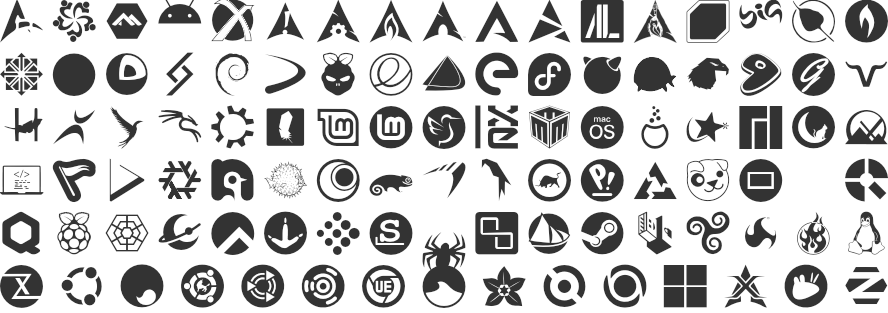
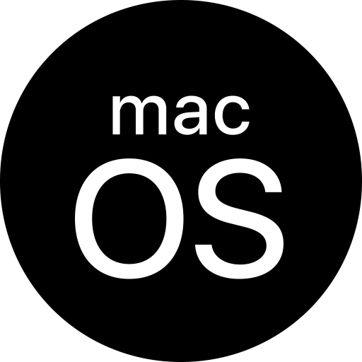
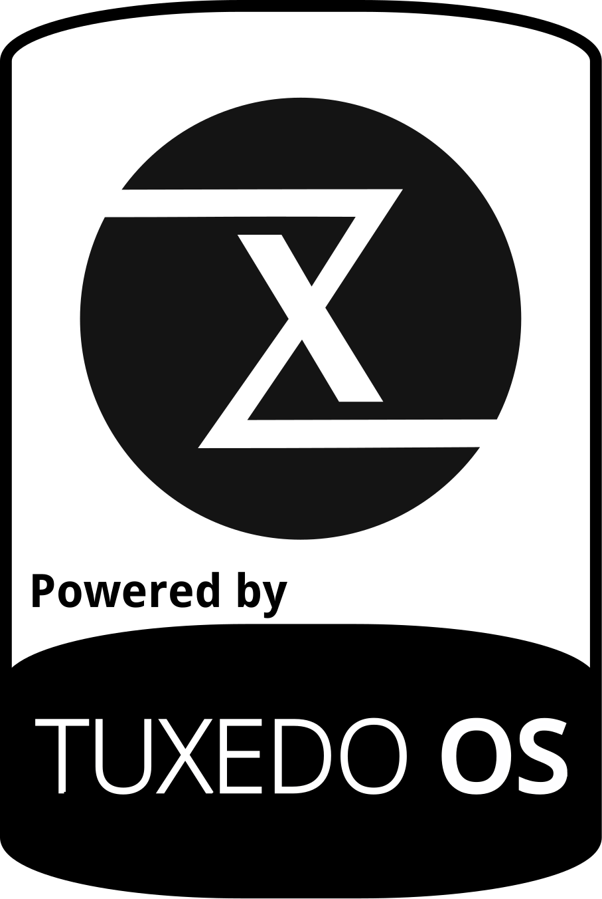

# quickemu-logos #

quickemu-logos is an icon font containing logos of popular linux distributions and other open source software.

*Note:* All brand icons are trademarks of their respective owners and should only be used to represent the company or product to which they refer.

## Installation ##

Install the font by downloading and unpacking the latest release's zip manually or installing it from npm:

	npm install quickemu-logos

To use the font, include `assets/quickemu-logos.css` as well as the
fonts in your project and use the CSS classes listed below.

	<link href="/assets/quickemu-logos.css" rel="stylesheet">

Alternatively just link to it using a CDN such as [jsDelivr](//jsdelivr.com):

	<link href="//cdn.jsdelivr.net/npm/quickemu-logos@1/assets/quickemu-logos.css" rel="stylesheet">

## Usage ##

Include an icon using the corresponding CSS class in an empty element:

	<i class="fl-[icon]"></i>

Add `fl-fw` as class for a fixed width icon.

If you want to insert a glyph of this font on a GNU/Linux system press `Ctrl + Shift + u`, release the keys and then type the code point, for instance: `Ctrl + Shift + u` and `f31a` will insert the `Tux` glyph.

Available logos are:

|       Distribution        |      CSS class       |                 Code                 | Code point |                       Image                        |
| ------------------------- | -------------------- | ------------------------------------ | :--------: | :------------------------------------------------: |
| Agarim OS                 | `fl-agarimos`        | `<i class="fl-agarimos"></i>`        |  `0xf302`  |         |
| Alma Linux                | `fl-almalinux`       | `<i class="fl-almalinux"></i>`       |  `0xf303`  |        |
| Alpine                    | `fl-alpine`          | `<i class="fl-alpine"></i>`          |  `0xf304`  |           |
| Android                   | `fl-android`         | `<i class="fl-android"></i>`         |  `0xf305`  |          |
| Antix                     | `fl-antix`           | `<i class="fl-antix"></i>`           |  `0xf306`  |            |
| Archbang                  | `fl-archbang`        | `<i class="fl-archbang"></i>`        |  `0xf307`  |         |
| Archcraft                 | `fl-archcraft`       | `<i class="fl-archcraft"></i>`       |  `0xf308`  |        |
| ArchLabs                  | `fl-archlabs`        | `<i class="fl-archlabs"></i>`        |  `0xf309`  |         |
| Arch Linux                | `fl-archlinux`       | `<i class="fl-archlinux"></i>`       |  `0xf30a`  |        |
| ArcoLinux                 | `fl-arcolinux`       | `<i class="fl-arcolinux"></i>`       |  `0xf30b`  |        |
| Artix Linux               | `fl-artixlinux`      | `<i class="fl-artixlinux"></i>`      |  `0xf30c`  |       |
| Arya Linux                | `fl-aryalinux`       | `<i class="fl-aryalinux"></i>`       |  `0xf30d`  |        |
| Athena OS                 | `fl-athenaos`        | `<i class="fl-athenaos"></i>`        |  `0xf30e`  |         |
| BackBox                   | `fl-backbox`         | `<i class="fl-backbox"></i>`         |  `0xf30f`  |          |
| BigLinux                  | `fl-biglinux`        | `<i class="fl-biglinux"></i>`        |  `0xf310`  |         |
| Bodhi Linux               | `fl-bodhi`           | `<i class="fl-bodhi"></i>`           |  `0xf311`  |            |
| bunsenlabs                | `fl-bunsenlabs`      | `<i class="fl-bunsenlabs"></i>`      |  `0xf312`  |       |
| CentOS                    | `fl-centos`          | `<i class="fl-centos"></i>`          |  `0xf313`  |           |
| Cereus Linux              | `fl-cereus`          | `<i class="fl-cereus"></i>`          |  `0xf314`  |           |
| CoreOS                    | `fl-coreos`          | `<i class="fl-coreos"></i>`          |  `0xf315`  |           |
| Crystal Linux             | `fl-crystal`         | `<i class="fl-crystal"></i>`         |  `0xf316`  |          |
| Debian                    | `fl-debian`          | `<i class="fl-debian"></i>`          |  `0xf317`  |           |
| Devuan                    | `fl-devuan`          | `<i class="fl-devuan"></i>`          |  `0xf318`  |           |
| DietPi                    | `fl-dietpi`          | `<i class="fl-dietpi"></i>`          |  `0xf319`  |           |
| elementary OS             | `fl-elementary`      | `<i class="fl-elementary"></i>`      |  `0xf31b`  |       |
| Endeavour OS              | `fl-endeavouros`     | `<i class="fl-endeavouros"></i>`     |  `0xf31c`  |      |
| /e/ OS                    | `fl-eos`             | `<i class="fl-eos"></i>`             |  `0xf31a`  |              |
| Fedora                    | `fl-fedora`          | `<i class="fl-fedora"></i>`          |  `0xf31d`  |           |
| FreeBSD                   | `fl-freebsd`         | `<i class="fl-freebsd"></i>`         |  `0xf31e`  |          |
| FreeDOS                   | `fl-freedos`         | `<i class="fl-freedos"></i>`         |  `0xf31f`  |          |
| Garuda Linux              | `fl-garuda`          | `<i class="fl-garuda"></i>`          |  `0xf320`  |           |
| Gentoo                    | `fl-gentoo`          | `<i class="fl-gentoo"></i>`          |  `0xf321`  |           |
| GhostBSD                  | `fl-ghostbsd`        | `<i class="fl-ghostbsd"></i>`        |  `0xf322`  |         |
| GNU Guix                  | `fl-gnuguix`         | `<i class="fl-gnuguix"></i>`         |  `0xf323`  |          |
| Haiku                     | `fl-haiku`           | `<i class="fl-haiku"></i>`           |  `0xf324`  |            |
| Hyperbola GNU/Linux-libre | `fl-hyperbola`       | `<i class="fl-hyperbola"></i>`       |  `0xf325`  |        |
| illumos                   | `fl-illumos`         | `<i class="fl-illumos"></i>`         |  `0xf326`  |          |
| Kali Linux                | `fl-kalilinux`       | `<i class="fl-kalilinux"></i>`       |  `0xf327`  |        |
| Kubuntu                   | `fl-kubuntu`         | `<i class="fl-kubuntu"></i>`         |  `0xf355`  |          |
| Linux Lite                | `fl-linuxlite`       | `<i class="fl-linuxlite"></i>`       |  `0xf328`  |        |
| Linux Mint                | `fl-linuxmint`       | `<i class="fl-linuxmint"></i>`       |  `0xf329`  |        |
| Linux Mint Debian Edition | `fl-lmde`            | `<i class="fl-lmde"></i>`            |  `0xf32a`  |             |
| Lubuntu                   | `fl-lubuntu`         | `<i class="fl-lubuntu"></i>`         |  `0xf356`  |          |
| LXLE Linux                | `fl-lxle`            | `<i class="fl-lxle"></i>`            |  `0xf32b`  |             |
| Mabox                     | `fl-mabox`           | `<i class="fl-mabox"></i>`           |  `0xf32c`  |            |
| macOS                     | `fl-macos`           | `<i class="fl-macos"></i>`           |  `0xf32d`  |            |
| Mageia                    | `fl-mageia`          | `<i class="fl-mageia"></i>`          |  `0xf32e`  |           |
| Mandriva                  | `fl-mandriva`        | `<i class="fl-mandriva"></i>`        |  `0xf32f`  |         |
| Manjaro                   | `fl-manjaro`         | `<i class="fl-manjaro"></i>`         |  `0xf330`  |          |
| MidnightBSD               | `fl-midnightbsd`     | `<i class="fl-midnightbsd"></i>`     |  `0xf331`  |      |
| MX Linux                  | `fl-mxlinux`         | `<i class="fl-mxlinux"></i>`         |  `0xf332`  |          |
| netboot.xyz               | `fl-netbootxyz`      | `<i class="fl-netbootxyz"></i>`      |  `0xf334`  |       |
| netBSD                    | `fl-netbsd`          | `<i class="fl-netbsd"></i>`          |  `0xf333`  |           |
| NitruX                    | `fl-nitrux`          | `<i class="fl-nitrux"></i>`          |  `0xf335`  |           |
| NixOS                     | `fl-nixos`           | `<i class="fl-nixos"></i>`           |  `0xf336`  |            |
| Nobara                    | `fl-nobara`          | `<i class="fl-nobara"></i>`          |  `0xf337`  |           |
| OpenBSD                   | `fl-openbsd`         | `<i class="fl-openbsd"></i>`         |  `0xf339`  |          |
| Open Mandriva             | `fl-openmandriva`    | `<i class="fl-openmandriva"></i>`    |  `0xf338`  |     |
| OpenSUSE                  | `fl-opensuse`        | `<i class="fl-opensuse"></i>`        |  `0xf33a`  |         |
| Parabola GNU/Linux-libre  | `fl-parabola`        | `<i class="fl-parabola"></i>`        |  `0xf33b`  |         |
| Parrot security           | `fl-parrotsecurity`  | `<i class="fl-parrotsecurity"></i>`  |  `0xf33c`  |   |
| PCLinuxOS                 | `fl-pclinuxos`       | `<i class="fl-pclinuxos"></i>`       |  `0xf33e`  |        |
| Pop!_OS                   | `fl-popos`           | `<i class="fl-popos"></i>`           |  `0xf33f`  |            |
| PostmarketOS              | `fl-postmarketos`    | `<i class="fl-postmarketos"></i>`    |  `0xf340`  |     |
| Puppy Linux               | `fl-puppy`           | `<i class="fl-puppy"></i>`           |  `0xf33d`  |            |
| PureOS                    | `fl-pureos`          | `<i class="fl-pureos"></i>`          |  `0xf341`  |           |
| Q                         | `fl-q`               | `<i class="fl-q"></i>`               |  `0xf301`  |                |
| Q4OS                      | `fl-q4os`            | `<i class="fl-q4os"></i>`            |  `0xf342`  |             |
| QubesOS                   | `fl-qubesos`         | `<i class="fl-qubesos"></i>`         |  `0xf343`  |          |
| Raspberry pi              | `fl-raspberry-pi`    | `<i class="fl-raspberry-pi"></i>`    |  `0xf344`  |     |
| RebornOS                  | `fl-rebornos`        | `<i class="fl-rebornos"></i>`        |  `0xf345`  |         |
| Regolith                  | `fl-regolith`        | `<i class="fl-regolith"></i>`        |  `0xf346`  |         |
| Rocky Linux               | `fl-rockylinux`      | `<i class="fl-rockylinux"></i>`      |  `0xf347`  |       |
| Sabayon                   | `fl-sabayon`         | `<i class="fl-sabayon"></i>`         |  `0xf348`  |          |
| siduction                 | `fl-siduction`       | `<i class="fl-siduction"></i>`       |  `0xf34c`  |        |
| Slackware                 | `fl-slackware`       | `<i class="fl-slackware"></i>`       |  `0xf349`  |        |
| Slitaz                    | `fl-slitaz`          | `<i class="fl-slitaz"></i>`          |  `0xf34a`  |           |
| smartos                   | `fl-smartos`         | `<i class="fl-smartos"></i>`         |  `0xf34b`  |          |
| Solus                     | `fl-solus`           | `<i class="fl-solus"></i>`           |  `0xf34d`  |            |
| SteamOS                   | `fl-steamos`         | `<i class="fl-steamos"></i>`         |  `0xf34e`  |          |
| Tails                     | `fl-tails`           | `<i class="fl-tails"></i>`           |  `0xf34f`  |            |
| Trisquel GNU/Linux        | `fl-trisquel`        | `<i class="fl-trisquel"></i>`        |  `0xf350`  |         |
| TrueNAS core              | `fl-truenas-core`    | `<i class="fl-truenas-core"></i>`    |  `0xf351`  |     |
| TrueOS                    | `fl-trueos`          | `<i class="fl-trueos"></i>`          |  `0xf352`  |           |
| Tux                       | `fl-tux`             | `<i class="fl-tux"></i>`             |  `0xf300`  |              |
| Tuxedo OS                 | `fl-tuxedoos`        | `<i class="fl-tuxedoos"></i>`        |  `0xf353`  |         |
| Ubuntu                    | `fl-ubuntu`          | `<i class="fl-ubuntu"></i>`          |  `0xf354`  |           |
| Ubuntu Budgie             | `fl-ubuntu-budgie`   | `<i class="fl-ubuntu-budgie"></i>`   |  `0xf358`  |    |
| Ubuntu Kylin              | `fl-ubuntu-kylin`    | `<i class="fl-ubuntu-kylin"></i>`    |  `0xf359`  |     |
| Ubuntu Mate               | `fl-ubuntu-mate`     | `<i class="fl-ubuntu-mate"></i>`     |  `0xf35a`  |      |
| Ubuntu Studio             | `fl-ubuntu-studio`   | `<i class="fl-ubuntu-studio"></i>`   |  `0xf35b`  |    |
| Ultimate Edition          | `fl-ultimateedition` | `<i class="fl-ultimateedition"></i>` |  `0xf35c`  |  |
| Ultramarine               | `fl-ultramarine`     | `<i class="fl-ultramarine"></i>`     |  `0xf35d`  |      |
| Vanilla OS                | `fl-vanilla`         | `<i class="fl-vanilla"></i>`         |  `0xf35e`  |          |
| Void Linux                | `fl-voidlinux`       | `<i class="fl-voidlinux"></i>`       |  `0xf35f`  |        |
| VXlinux                   | `fl-vxlinux`         | `<i class="fl-vxlinux"></i>`         |  `0xf360`  |          |
| Whonix                    | `fl-whonix`          | `<i class="fl-whonix"></i>`          |  `0xf361`  |           |
| Windows                   | `fl-windows`         | `<i class="fl-windows"></i>`         |  `0xf362`  |          |
| XeroLinux                 | `fl-xerolinux`       | `<i class="fl-xerolinux"></i>`       |  `0xf363`  |        |
| Xubuntu                   | `fl-xubuntu`         | `<i class="fl-xubuntu"></i>`         |  `0xf357`  |          |
| Zorin OS                  | `fl-zorin`           | `<i class="fl-zorin"></i>`           |  `0xf364`  |            |

## Building ##

Make sure you have the following dependencies installed:
* Node, Python and jq to run the build scripts
* [FontForge](//fontforge.org) to generate the fonts
* [wkhtmltopdf](http://wkhtmltopdf.org/) to generate this readme's preview image

Then run `npm install`/`yarn install` and `make`.

## Releasing ##

If you are a maintainer of this repository and a new release is to be published
* Make sure all PRs (that shall be pulled) are pulled
  * The PRs add new `svg`s in `vectors/`
  * The `icons.tsv` is ammended (i.e. new icons added at the bottom)
* Every time the `svg`s or `icons.tsv` is touched in the `master` branch (i.e. through pulling) the preview image is updated
* Note that the `README.md` is NOT updated. You can manually modify it do indicate/add recently added but not released icons.
* Once the release seems ready:
* Edit the version number in `package.json` (and push that change to `master`)
* Trigger the "Draft a Release" workflow manually on the Actions page (on the `master` branch)
  * The workflow will add a git tag for the release
* Go to the releases list and find the draft release
  * Edit the description etc pp and finally
  * Push "publish release"
  * The release is published on Github
* Automatically the "Update README" workflow is triggered
  * The `README.md` is regenerated (the preview should already be up to date, see above)
* Automatically the "Publish release to npm" workflow is triggered
  * If the npm token is not expired the release is pushed to NPM
  * You need to publish on NPM manually if token is expired (expected)
